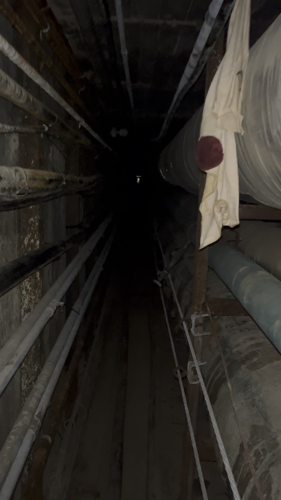
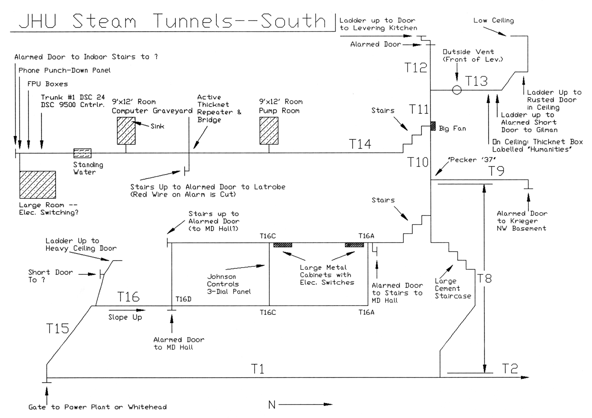
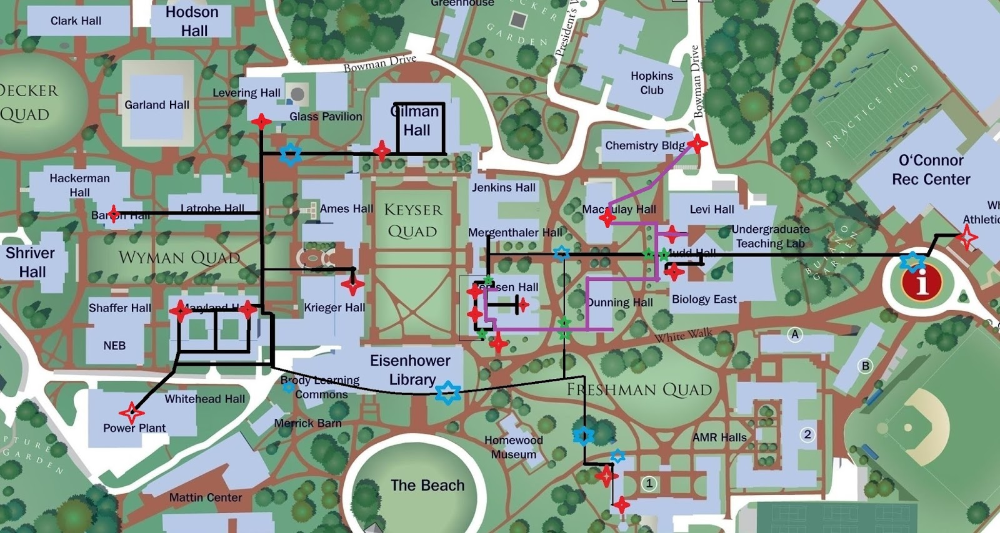

# JHU地下蒸汽隧道：历史，文化与校方态度

**05-23-2025，05-27-2025 修订  |  DH768154**

****

*本文由ChatGPT协助生成，不代表本人立场。*

---

## 引言

在约翰霍普金斯大学（Johns Hopkins University，简称JHU）Homewood 校区地下，延伸着一套百年前的蒸汽隧道网络。这套设施不仅承担着能源输送任务，也逐渐演变为一段带有神秘、亚文化色彩的校园传统。

[TOC]

---

## 一、历史与用途

### 建设背景与早期设计

约翰霍普金斯大学在1914年于Homewood校区建成一座动力厂（Power House），配备锅炉和发电设备，为校园提供集中供热、供电和蒸汽。高耸的烟囱成为校内早期工业基础设施的象征。除了满足教职员工和学生的日常能源需求，这座动力厂也为工程学院的学生提供了实践场所，其生产的多余电力甚至一度对外出售给巴尔的摩市。

虽然目前尚无确凿资料明确指出地下蒸汽隧道系统的具体开建年份，但考虑到其功能依附于1914年建成的动力厂，并用于将蒸汽输送至各主要建筑，可推测在动力厂建成同期或不久之后，地下管道网络即已逐步铺设，成为支撑整个校园能源系统的重要组成部分。

**来源**：[JHU Engineering Magazine，《Rewind: A Powerful Learning Laboratory》（2019年5月）](https://engineering.jhu.edu/magazine/2019/05/rewind-a-powerful-learning-laboratory)

这一动力站毗邻今日的Whitehead工程楼，事实上，工程学院在Homewood校园建筑和道路的规划监督中扮演了重要角色，包括供暖和发电厂的建设：

> The School… played a major role in the planning and supervision of the Homewood campus… as well as the heating and power plants.

伴随着集中锅炉房投入运行，一系列地下隧道被修建，用于敷设蒸汽管线、电线、水管等基础设施，将能源从动力站输送至教学楼和宿舍。

**来源**：

- [JHU Magazine，《Under Homewood》（2000年11月）](https://pages.jh.edu/jhumag/1100web/under.html)
- [JHU Engineering Magazine，《John Boswell Whitehead: First Spark, Genius》（2004年7月）](https://engineering.jhu.edu/magazine/2004/07/john-boswell-whitehead-first-spark-genius)

这些隧道纵横交错，总长度达数英里，大部分区域宽度和高度可以让一个中等身高的人直立行走。隧道内部铺设了供暖蒸汽管、自来水管、下水道、电力线乃至天然气管道等，各类管线沿隧道壁分布；从功能上说，这些地下管道网就像校园的静脉与动脉，源源不断为大学这一有机体输送“生命能量”。正如报道所形容的：“

> 地下隧道如同校园重要器官的静脉与动脉。 
>
> These tunnels are the veins and arteries for the university's vital organs.

这种集中供能系统在当时属于现代化的校园基础设施，使学校各建筑能够共享集中供应的蒸汽暖气，制冷和电力，提高了能源利用效率。

这些早期修建的隧道结构坚固，主要由砖石和混凝土构成通道，以便工作人员能够定期进入其中检修管线。出于安全与维护考虑，热力管道通常包裹有厚厚的隔热材料（早期多为石棉等保温材料），以防止热量散失和人员烫伤。

  

<b>砖石和混凝土构成的隧道</b>

在历史上，这些地下空间也曾被某些科研人员临时借用用于存储实验材料。例如，材料科学教授 Bob Pond 曾在其中存放测试样品；而地质学家 Joseph Singewald 则将含硫矿石样本储存在 Latrobe Hall 地下段，最终因高温潮湿环境引发腐蚀反应，造成空气酸化、木盒劣化。

**来源**：[JHU Magazine，《Under Homewood》（2000年11月）](https://pages.jh.edu/jhumag/1100web/under.html)

---

### 拓展与技术演进

随着校园在持续扩张，Homewood 校区新建了多栋理工科楼宇，以容纳快速增长的科研项目和学生数量。其中包括Remsen Hall（1924），Krieger Hall（1929），Mergenthaler Hall（1941），和最初的Maryland Hall，Latrobe Hall，Gilman Hall等，构成了 Homewood 校区的主体部分。这些新建筑配套接入了原有的集中供能系统，使蒸汽隧道网络进一步延伸。

在1994年，JHU正式启用了North Chiller Plant，采用制冰储冷技术，在夜间低谷时段制冰储能，白天则融冰供冷，为校园建筑提供空调制冷所需的冷冻水。根据校方介绍，这套系统不仅用于教学楼和办公区域的降温，还被间接用于科研设备的温控支持，例如天体物理实验室中的科研仪器。根据2000年数据显示，Homewood校区每年消耗约2.37亿磅的蒸汽和1300万吨冷冻水，用于全年供暖和制冷。

庞大的能源输送任务由地下管道网络承担，构成校园隐形但关键的运行基础。

**来源**：

- [JHU Engineering Magazine，《John Boswell Whitehead: First Spark, Genius》（2004年7月）](https://engineering.jhu.edu/magazine/2004/07/john-boswell-whitehead-first-spark-genius)
- [JHU Gazette，《North Chiller Plant Uses Ice to Cool Campus》（1994年9月6日）](https://pages.jh.edu/gazette/1994/sep0694/chill.html)
- [JHU Magazine，《Under Homewood》（2000年11月）](https://pages.jh.edu/jhumag/1100web/under.html)

值得注意的是，在战后校园建设中，蒸汽隧道系统布局出现了“两种不同类型的隧道”。一类是类似早期那样的传统公用蒸汽隧道，主要分布于老校园核心区地下；另一类是在新建理工科楼附近出现的“维护隧道”（Maintenance Tunnels）。后者实际上是建筑地下室延伸出来的走廊式通道。如1960年代至1970年代修建的Mudd Hall、Dunning Hall等理工科楼宇地下，就配套建有宽敞明亮的维护隧道。这些维护隧道更像是服务于建筑机房的地下走廊，空间宽阔可容两人并行，照明充足，甚至不上锁，以方便工作人员通行。据一位校友回忆：

> 我曾在这些维护隧道里与JHU员工擦肩而过，对方也并未干涉。
>
> I have walked past JHU employees in these tunnels without any incident.

可见维护隧道已被视作校园基础设施的一部分，允许授权人员出入，并可用于必要时在楼宇之间短途通行。

**来源**：[Ghost-Six Blog，《JHU Steam Tunnels》（2016年2月）](https://ghost-six.blogspot.com/2016/02/jhu-steam-tunnels.html?m=1)

  

<b>宽敞明亮的维护隧道</b>

与之相对，老一代的蒸汽隧道隧道则显得幽闭而原始。这类隧道大多位于早期建筑下方，空间狭窄昏暗，有些路段甚至毫无照明且常年积水。正如一名亲历者所描述的：

> 这些通道通常光线昏暗，有时甚至完全没有照明，环境肮脏，有时还会积水。正如它们的名字所示，墙上裸露着一些管道，温度高到一碰就可能被烫伤。
>
> They are dimly (and sometimes not at all) lit, dirty, sometimes flooded, and as their name implies they have unprotected pipes running along the walls which can be hot enough to burn if you touch them. 

  

<b>某段没有任何照明，仅容一人侧身通过的隧道</b>

两种隧道系统在校园地下交织：例如维护隧道在Mudd Hall里通过侧门连接到主蒸汽隧道，在Dunning Hall与Remsen Hall之间也有竖井接口沟通两套系统。

**来源**：[Ghost-Six Blog，《JHU Steam Tunnels》（2016年2月）](https://ghost-six.blogspot.com/2016/02/jhu-steam-tunnels.html?m=1)

  

<b>Remsen地下的竖井</b>

总体而言，Homewood主校区地下旧有隧道主要服务早期建筑，而新的的教学楼则多采用直接埋设管线，意味着新建筑的公用管线不再像老隧道那样有人可通行的空间。例如1954年建造的Shriver Hall和1997年建造的的Olin Hall等，都未接入可步行的蒸汽隧道系统。

**来源**：[JHU Magazine，《Under Homewood》（2000年11月）](https://pages.jh.edu/jhumag/1100web/under.html)

这在一定程度上是由于后期施工成本、校园规划等因素，使得直接埋管供热成为更现实的选择。但无论采用何种敷设方式，地下蒸汽隧道网络依旧在校园能源供应中扮演核心角色，从百年前一直运作至今。

然而，对部分学生而言，这些看似冰冷的管道，还隐藏着另一重意义。

---

## 二、学生探险与地下文化

### 流传的传说与隧道魅力

尽管地下蒸汽隧道的本意在于后勤供能，且校方明文规定禁止非授权人员进入蒸汽隧道，但其幽闭神秘的空间、多年沉淀的历史感，对学生而言却有着难以抗拒的吸引力，在 JHU 学生群体中衍生出一种特殊的“地下文化”：充满危险、禁忌、挑战与浪漫色彩的“蒸汽隧道探险”（steam tunnel spelunking）。围绕这些地下隧道，逐渐在校园中衍生出各种传说和“都市传奇”。有传言称，在物理楼下方的蒸汽隧道里栖息着被实验辐射所变异的巨型兔子，守护着幽暗隧道的深处。

**来源**：[Ivy Scholars，《Johns Hopkins University Guide》](https://www.ivyscholars.com/johns-hopkins-university-guide)

又比如，有关“幽灵”的传闻也层出不穷，一些学生声称在隧道深处听到过奇怪的声响或看到不明影子。这些传说为地下隧道平添了几分诡秘色彩。

不仅如此，隧道中的真实痕迹更激发着后来者的好奇心。在地下管道的墙壁上，历届潜入其中的学生往往会留下涂鸦、签名或箴言警句，仿佛在向后来者诉说他们曾经来过。有人报告在隧道深处看到了这样一句让人脊背发凉的涂鸦：

> 知识的摇篮之下埋葬着那些殒落者的白骨。 
>
> Under the cradle of knowledge lies the bones of those that have fallen.

**来源**：[The Johns Hopkins News-Letter，《The Steam Tunnels Behind Our Underground Tradition》（2018年11月）](https://www.jhunewsletter.com/article/2018/11/the-steam-tunnels-behind-our-underground-tradition)													 

  

<b>学生留下的涂鸦</b>

虽然听起来夸张诡异，但它折射出地下探险的危险性和挑战性。也正因平日“普通人不得入内”的禁忌色彩，这些隧道更激发了学生的探奇心理。

地下蒸汽隧道早已融入约翰霍普金斯大学独特的校园文化，成为几代学生口耳相传的“秘境”。很多Hopkins学子视能够成功潜入隧道、亲眼目睹地下景象为一种另类的“荣耀”，仿佛接力传承着前辈的探险传奇。对于某些富有冒险精神的年轻人来说，能在毕业前夜闯荡一次神秘的蒸汽隧道，彷佛才能不留校园遗憾。这种地下文化虽然隐秘，却顽强地延续。

---

### 探险经历与学生社群

随着关于蒸汽隧道的传说愈演愈烈，一批批敢于以身犯险的学生踏入了这片地下世界，并逐渐形成了松散的探险者社群。他们中有的人将自己的经历记录下来，通过校园媒体、网络论坛等渠道匿名分享，为后来者提供指引和戒训。通过这些口耳相传和网络交流，Hopkins地下蒸汽隧道的“地图”在近十余年间被越绘越完整。

学生之间私下流传入入口位置和路径图，其中最早流传的一份地图绘于1990年代，标注为“circa 1996”，由后人上传至Reddit，虽然内容简略，但作为JHU探险文化的早期见证，具有一定历史地位。

**来源**：[Reddit，《Partial JHU Steam Tunnel Map》（1996年）](https://www.reddit.com/r/jhu/comments/2mx0cd/partial_jhu_steam_tunnel_map_circa_1996/)

  

<b>1996年的隧道地图</b>

而目前最为详细、最具影响力的资料，则是2016年匿名作者Ghost-Six所发布的实地博客。他不仅绘制了完整的通道地图，还拍摄了管道内部照片，详细描述了多个入口、分支路径、结构风险和注意事项。这篇博客被视为JHU地下探险文化的“权威文献”，至今仍被学生广泛参考。

据 Ghost-Six博客及多名学生探险者的记录，这些地下通道多为砖砌或混凝土结构，部分区域空间足够让人直立通行，也有较狭窄的段落需要弯腰或爬行。根据校方与校友的公开描述，这些通道主要由设施管理部门维护使用，对外封闭，内部环境受蒸汽影响较大，常年潮湿、闷热，地面偶有积水。目前通道入口大多加装有单向锁，属于限制区域，仅设施团队可进入。

**来源**：

- [Ghost-Six Blog，《JHU Steam Tunnels》（2016年2月）](https://ghost-six.blogspot.com/2016/02/jhu-steam-tunnels.html?m=1)
- [The Johns Hopkins News-Letter，《The steam tunnels behind our underground tradition》（2018年11月）](https://www.jhunewsletter.com/article/2018/11/the-steam-tunnels-behind-our-underground-tradition)

  

<b>某段足以直立通行的隧道</b>

探险者描述，这些通道昏暗潮湿，充满灰尘和老旧设备的气味，部分区域残留着20世纪的机械系统、风机、断电控制箱、冷凝水泵。曾有学生在通道尽头发现一台1980年代老旧计算机，旁边堆着早已过期的办公物品和啤酒罐，俨然成为时间封存的“地下档案室”。

  

<b>“Computer Room”中的老旧计算机</b>

Reddit等网络论坛也成为学生交流隧道探险心得的平台。在r/JHU版上，不少帖子讨论如何进入隧道、分享其中的见闻。一些已毕业的校友现身说法，向学弟学妹提供经验。有位昵称BiPhi的校友就发布了他当年绘制的隧道详细地图，与学弟GHOST6的地图几乎完全吻合。

> 很高兴在约翰霍普金斯大学看到一位志同道合的人。这是我做的地图。几乎完全符合。
>
> I'm edified to see a kindred spirit at JHU. This was the map I made. It almost agrees perfectly.

这位前辈还描述了一些隧道内令他印象深刻的细节：例如在Remsen楼地下有一段须匍匐前进的狭窄爬行空间，其中间“莫名其妙放着一把让人瘆得慌的破椅子”。种种离奇景象在他们笔下栩栩如生，进一步吊起了后来年轻人的好奇心。

**来源**：[Reddit，《JHU Steam Tunnels》（讨论帖，2016年2月）](https://old.reddit.com/r/jhu/comments/460k4v/jhu_steam_tunnels)		

  

    
    
<b>by BiPhi</b>

  

  

    
    
<b>by Ghost-Six</b>

  

通过这些年的积累，学生探险者群体已经摸索出一套“地下准则”和非正式的组织方式。他们不会公开招募成员，但会在私下里物色可信的同好，一起组队在深夜行动。有经验的前辈会传授新人一些规避风险的技巧，比如从相对隐蔽且“安全的入口”进入、携带手电筒和口罩（以防灰尘和可能的石棉）、全程保持安静等等。

有趣的是，有些探险者甚至将隧道视为神秘空间，试图‘通灵’Hopkins本人、考古馆木乃伊或已故教授Ira Remsen的灵魂。这些行为虽带有戏谑和仪式化意味，但这类做法反映出学生对蒸汽隧道的神秘想象。

**来源**：[The Johns Hopkins News-Letter，《The steam tunnels behind our underground tradition》（2018年11月）](https://www.jhunewsletter.com/article/2018/11/the-steam-tunnels-behind-our-underground-tradition)

  

<b>某些神秘仪式</b>

> 关于蒸汽管道的传说，以及禁地这一观念，或许比实际产生的影响更具意义。“如果你进了蒸汽管道，那你就永远不能谈论这件事。
>
> The lore and the idea that it’s forbidden might be more important than the actual ramifications. “If you go into the steam tunnels then you can never talk about it”.
>
> ——David Rose, Class of 2009

**来源**：[The Johns Hopkins News-Letter，《The steam tunnels behind our underground tradition》（2018年11月）](https://www.jhunewsletter.com/article/2018/11/the-steam-tunnels-behind-our-underground-tradition)

---

## 三、官方态度：禁止但宽容

### 安全隐患与校方禁令

从校方正式政策来看，地下蒸汽隧道绝非供学生游览的地方。学校设施管理部门和安全办公室多次明确表示，禁止学生擅自进入任何公用隧道或管道空间。这首先是出于安全考虑。正如一位校方代表在接受校报采访时通过邮件郑重声明的：

> **学生绝不应该进入那些公用隧道** 
>
> Students should never enter the utility tunnels.

他进一步强调：

> 这些隧道里有高压蒸汽管，一旦在靠近人员处发生意外泄漏，将造成极其危险的状况。
>
> These tunnels contain high pressure steam lines that can present extremely dangerous conditions if an unexpected leak occurs close to a person…

**来源**：[The Johns Hopkins News-Letter，《The Steam Tunnels Behind Our Underground Tradition》（2018年11月）](https://www.jhunewsletter.com/article/2018/11/the-steam-tunnels-behind-our-underground-tradition)

确实，蒸汽隧道内部温度很高，主干管道中的蒸汽温度可达数百华氏度，压力巨大。如果有人靠近时管道突然破裂喷出高温蒸汽，极有可能导致严重烫伤甚至危及生命。此外，隧道内空间密闭狭窄，通风不良，可能积聚着灰尘、有害气体或缺氧；一些老旧管道保温层可能含有石棉等有害物质；再加上照明不足、道路湿滑，一旦迷路或受伤，在地下很难第一时间得到救助。

**来源**：[Reddit，《JHU Steam Tunnels》（讨论帖，2016年2月）](https://old.reddit.com/r/jhu/comments/460k4v/jhu_steam_tunnels)

  

<b>狭窄低矮的隧道空间</b>

所有这些安全隐患都是校方明令禁止学生进入的理由。

---

### 非正式默许与文化认同

尽管官方三令五申禁止，地下蒸汽隧道探险在Hopkins校园却呈现出一种“禁而不绝”的独特现象。这其中固然有隧道入口难以完全封堵的客观原因，但更深层的原因在于校方对这一长期存在的学生亚文化采取了某种程度的默许态度。在确保大局安全的前提下，学校并未穷尽手段去杜绝学生的冒险行为，某种程度上似乎是认可其作为一种非正式校园传统。

这种宽容态度从一些细节上可见一斑。首先，校方高层对学生钻隧道一事并非不知情，甚至曾以幽默方式公开提及。

2016年毕业典礼上，约翰霍普金斯大学校长Ronald J. Daniels在致辞中风趣地向毕业生们列举了几项在校期间可能思考过的“重大问题”，其中就包括：

> 你们会偷偷溜进哪里？吉尔曼钟楼？蒸汽隧道？或许，都试一试？
>
> Where will you sneak into? The Gilman bell tower? The steam tunnels? Maybe both?

校长以玩笑口吻提及了这一学生惯常的“冒险”，似乎是承认了蒸汽隧道探险已是校园文化的一部分。这番话从侧面透露出校方对学生探险行为的态度：虽然规章上不允许，但也默认这是学生时代的一种经历和谈资。

**来源**：[JHU Hub，《Commencement 2016: President Daniels' Remarks》（2016年5月18日）](https://hub.jhu.edu/2016/05/18/commencement-2016-daniels)

不仅在毕业典礼上提及，校长也曾在2022年开学典礼中再次提到蒸汽隧道：

> 体育馆旁边那条奇怪的蒸汽隧道里有什么？请别去 Reddit 上查，那只会让你更紧张。
>
> What’s in that weird steam tunnel next to the rec center? Please don’t look it up on Reddit. It will only make you more anxious.

**来源**：[JHU President’s Office，《Convocation for the Class of 2026》（2022年8月28日）](https://president.jhu.edu/speeches/2022/08/28/convocation-for-the-class-of-2026/)

校领导的半开玩笑表态无疑给这一地下传统赋予了某种正当性，让学生们倍感共鸣。

---

### 学生独立媒体对蒸汽秘道的相关调侃

《The Johns Hopkins News-Letter》是约翰霍普金斯大学创刊于1896年的学生独立媒体，由本科生自主编辑与运营，不代表学校官方立场。尽管如此，该刊物在校内影响力显著，内容涵盖新闻、评论、讽刺专栏等，其多次涉及蒸汽隧道话题，也反映了学生群体对这一“地下文化”的持续关注。例如：

• 2022年愚人节特刊称，确诊新冠学生将被安置到蒸汽隧道内，并由“专业老鼠”担任保安。

**来源**：[The Johns Hopkins News-Letter，《Quarantine housing to be moved to steam tunnels》（2022年4月1日）](https://www.jhunewsletter.com/article/2022/04/quarantine-housing-to-be-moved-to-steam-tunnels)

• 2025年愚人节特刊虚构了一场“蒸汽隧道派对”被校警突袭，21人被捕，4人拘留。文章正文明确注明为虚构新闻，旨在调侃现实执法尺度。
**来源**：[The Johns Hopkins News-Letter，《Hopkins Police Department busts student rave in steam tunnels》（2025年4月1日）](https://www.jhunewsletter.com/article/2025/04/hopkins-police-department-busts-student-rave-in-steam-tunnels)

值得注意的是，尽管《News-Letter》长期以调侃形式报道蒸汽隧道话题，但校方从未对其内容发布公开否认或发表严正声明。这种“未干预”的姿态也在一定程度上反映出官方在执行层面的宽容态度

——即 ”**规章上禁止、文化上默认、操作上宽容**”。

---

### 学校的宽松管理

虽然学校规定禁止进入，但目前并无确凿报道表明单个学生因擅入蒸汽隧道而被正式逮捕或起诉。相反，相关事件出现在愚人节特刊中，虚构成集体性“狂欢事件”并遭逮捕。这说明实际执法以防范为主，鲜少高压管控。

作者“Ghost-Six”在2016年发布的博客文章中记录了他实地探索JHU蒸汽隧道的过程，附带自绘地图，详细描述多个入口位置及地下路径。而截至2025年5月，该博客中记录的几乎所有出入口仍未被封死。更有学生报告称，原本设计为“只出不进”的出口，现在也成了新的双向通行入口。若校方确有封堵意图，完全可以加装报警装置、设置单向门锁、焊死出入口或安装感应器。而现实中未采取上述措施，表明校方对学生“地下探险”行为并未强力干预，实际管理上呈现出某种程度的默认与文化宽容。

JHU校方对地下蒸汽隧道探险持有一种“表面禁止、私下宽容”的态度：在公开政策和安全声明上严正禁止，以防范意外责任；但在实际校园生活中，对这类带有传统色彩的学生冒险并未赶尽杀绝，而是保持一定的弹性空间。这种平衡既维护了校园安全，又使得学生时代那份勇于探索的好奇心得到了隐性的尊重。正因如此，蒸汽隧道探险才能在Hopkins历经数十载仍旧薪火相传，成为校园记忆的一部分。

---

## 四、结语

约翰霍普金斯大学地下蒸汽隧道凝结了学校基础设施的历史演进轨迹，也承载着几代学生的青春冒险记忆。一方面，它是20世纪初现代校园建设的产物，见证了学校能源系统从煤火锅炉到汽轮机再到当代清洁能源的变迁；其纵横交错的隧道至今仍默默履行着为校园输送暖流和光明的职责。另一方面，这些蜿蜒幽深的地下通道催生出独特的校园亚文化——关于它的传说、探险的故事、不灭的好奇心，都成为Hopkins校园精神的一抹剪影。

校方在安全与传统之间谨慎拿捏，以明令禁止守住底线，以默许宽容留下余韵，既保障了师生安全，又默默允许青春的好奇在校园暗流中涌动。这正是 JHU 特有的“地下文化”：制度上禁止，文化上默许，执行上宽容。

正如有人所说，大学不仅在课堂和实验室塑造学生，也在塔楼和隧道中见证青春。那些黑暗中手电光摇曳的身影，也将与百年的蒸汽隧道一起，长存于Blue Jays的集体回忆之中。

> The tunnels have a way of shaping those who enter them. The smell stays in your clothes. You dream about it. It’s a rite of passage for some.
>
> 这些通道会在某种程度上塑造进入它们的人。那股气味会留在你的衣服上，你会梦见它。对有些人来说，这是一种成年礼。
>
> ——匿名学生

每个Blue Jay都在校园里留下了一段属于自己的秘密轨迹 —— 有人在深夜的图书馆里，有人在实验室的机器人旁，也有人在地下幽暗的隧道中。
